<div align="center">



<a href="https://git.io/typing-svg">
  
</a>

<br/>


</div>


## ✧･ﾟ: *✧ About me *:･ﾟ✧

> 🌸 **Dilemma:** *We can reduce the chances of dying, but you can never reduce them to zero.*

| ♡ | Miku Status Card |
|:--|:--|
| 🎤 **Waifu** | Hatsune Miku (needless to mention) |
| 💙 **Color** | `#39C5BB` |
| 🥬 **Fuel** | Leeks, instant ramen & manga |
| 🌌 **Dream** | Earth's orbit... and maybe other planets |
| 🤖 **Final boss** | An AGI called **The Director** |


## ✧･ﾟ: *✧ Tech stack *:･ﾟ✧

<div align="center">

 

**Languages:** Lua · Python · C++ · TypeScript · Rust<br/>
**Frameworks:** ReactJs · NextJs · Astro<br/>
**IDEs:** VSCode · Zed

</div>


## ✧･ﾟ: *✧ Stats *:･ﾟ✧

<div align="center">


</div>


## ✧･ﾟ: *✧ Loading dreams... *:･ﾟ✧

```text
🚀 Trip to Earth's orbit ... ▰▱▱▱▱▱▱▱▱▱  loading...
🪐 Other planets ........... ▱▱▱▱▱▱▱▱▱▱  maybe one day
🤖 The Director (AGI) ...... ▰▰▱▱▱▱▱▱▱▱  training...
💿 Miku collection ......... ▰▰▰▰▰▰▰▰▰▰  MAX ♡
```


<div align="center">

### 🎮 Do you have a Tibia server?

Join my Discord server and find out interesting things for it ✧

<a href="https://discord.com/servers/millhiore-bt-1018417615888199680">
  
</a>

<br/><br/>


</div>
